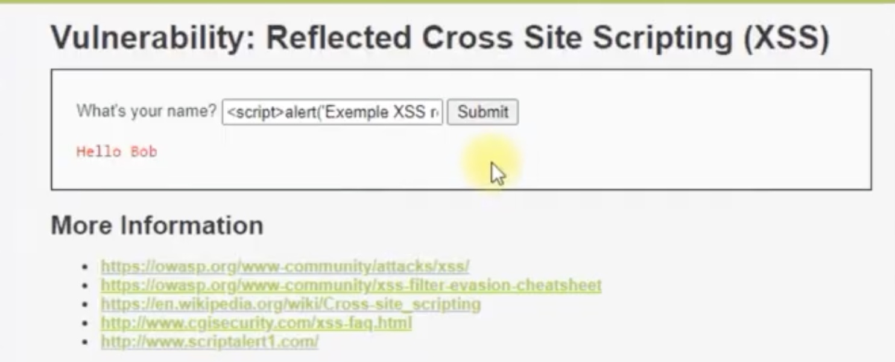
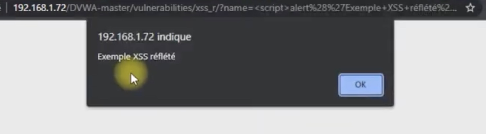

# FailleSecurity Project 

## Généralité 

Le projet a pour vocation d'exploiter une faille pour sensibiliser les personnes aux attaques de cybersécurité. 

## British Airways et sa faille XSS
**Service compromis**. 

La faille que nous avons choisi est de type XSS et a touché British Airways en 2018. 
L’entreprise a subi une attaque Magecart sur sa page de paiement en ligne.  
Les attaquants ont réussi à injecter des lignes de code JavaScript dans une bibliothèque tierce (Modernizr) chargée par le site web de British Airways.  
Ce script captait les informations saisies dans le formulaire  que remplissait l’utilisateur (nom, adresse, numéro de carte...) au moment où il validait son paiement par carte.  
Puis les envoyait vers un domaine contrôlé par les attaquants.
L’attaque a duré environ 2 semaines et a affecté plus de 380 000 clients.  
Ces données sensibles ont été exfiltrées sans interrompre la procédure de paiement normale, ce qui rendait l’attaque furtive.  
Ainsi, cette attaque est une compromission de l'intégrité du code puisque les attaquant ont rajouté des lignes de java et une compromissions des données car ce code leur permettait d'exporter des données sensibles d'utilisateurs vers leur propre domaine.

## Vulnérabilité expliquée 

**Faille XSS (Cross-Site Scripting)** : vulnérabilité de sécurité des pages Web, où l'attaquant arrive à injecter du code directement interprétable par un navigateur web, comme du JavaScript ou de l’HTML.  
Le navigateur ne fera aucune différence entre le code du site et celui injecté par l'attaquant, et exécutera le code.

Les possibilités sont nombreuses : redirection vers un autre site, vol de cookies, modification du code HTML de la page...

Les attaques côté client exploitent la relation de confiance entre un utilisateur et les sites Web qu'il visite.  
L'attaque où la connexion au contenu malveillant est initiée à partir du client (généralement en étant incité à cliquer sur un lien malveillant dans un e-mail, un message instantané, ou autre : user interaction often needed), contrairement aux server-side attacks où le serveur initie l'attaque (par exemple SQL injection).



Exemple de faille XSS dit **"reflected"**, en théorie, le site nous renvoit le texte entré dans la case du formulaire, le pirate via un formulaire injecte son code malicieux sous forme d'une balise **script**.



On voit bien que le serveur web d'adresse IP : 192.168.1.172 renvoit le contenu dans la balise **script** à savoir le texte : 'Exemple XSS reflété' avec une faute d'ortographe.  

L'objectif étant de cibler les vulnérabilités de l'appareil client ou d'un ou plusieurs de ses logiciels (comprennent des logiciels de traitement de texte, lecteur PDF, des navigateurs Web, environnement Java, etc) dans le but d’obtenir des informations sensibles (cookies, identifiants, numéro de CB, etc.) ou de prendre le contrôle des postes de travail infectés.


## Architecture et schéma de la faille


Ce schéma montre le cheminement classique d'une requête http lorsqu'un utilisateur va effectuer une recherche sur le web.

La requête est traitée suivant si l'intitulé est 'GET', 'POST' ... par le serveur.

- Le serveur web va traiter les fichiers .css, .php, .js ... correspondant à la "fabrication" de mon site en backend pour en ressortir un document .html qui peut être lu par mon navigateur et m'afficher un site tout beau tout propre.

- C'est au moment où la requête du web vers le serveur web que l'injection de script ou de requêtes SQL peut se faire.

- Le serveur web traite alors les fichiers correspondant avec un code extérieur dans sa structure non vérifié. 


## Comment se prémunir ?

Un **SAST (Static Application Security Testing)** est une méthode d’analyse de sécurité qui consiste à examiner le code source d’une application sans l’exécuter, afin de détecter automatiquement des failles comme les XSS, injections SQL ou erreurs de sécurité dès la phase de développement.  
 En effet, il permet d’identifier les vulnérabilités avant la mise en production, directement dans le code, ce qui réduit les risques et le coût des corrections.

Un **DAST (Dynamic Application Security Testing)** est une méthode de test de sécurité qui analyse une application en fonctionnement.  
 
En effet, il simule des attaques réelles en envoyant des requêtes malveillantes à l’application et observe ses réactions. Ce qui permet d’identifier les failles du point de vue d’un attaquant externe. Ainsi un **DAST**, à l'inverse du **SAST** (qui analyse le code), teste le comportement réel de l’application en conditions proches de la production.

**Quelques exemples de codes de sécurité**

```
<?php
header ("Mon site tout beau tout propre")
if (array_key_exists("name", $_GET ) && $_GET[ 'name' ] != NULL){
    $name = str_replace('<script>', '', $_GET[ 'name' ] );

    echo "<pre> Hello $(name)<pre>";
}
?>
```
Ce code .php présent dans le code source va permettre de remplacer l'input **'script'** s'il existe en une chaine vide de caractère avant qu'il soit incorporé dans le fichier .html et qu'il soit interprété comme une balise **'script'**.  

```
<?php
header ("Mon site tout beau tout propre")
if (array_key_exists("name", $_GET ) && $_GET[ 'name' ] != NULL){
    $name = preg_replace( '/<(.*)s(.*)c(.*)r(.*)i(.*)p(.*)t/i', '', $_GET[ 'name' ]);

    echo "<pre> Hello $(name)<pre>";
}
?>

```
Code .php contre l'écriture de **'script'** avec une majuscule. 

```
function secure($variable) {
        return htmlspecialchars(trim($variable), ENT_QUOTES, 'UTF-8');
    }

```
Fonction qui empêche l'ajout de caractères autres que des lettres (tout ce qui est <> pour l'ajout de bouttons ou de balises est impossible.)

- Mettre en place une CSP (Content Security Policy): cela permet de limiter les sources autorisées pour charger du JavaScript. Ainsi, même si un script malveillant est injecté, le navigateur le bloque s’il vient d’une source qui n'est pas autorisée.

- Mettre en place un **SRI (SubResource Integration)** permet de vérifier automatiquement que les fichiers JavaScript chargés (librairies externes) n'ont pas été modifiés. Donc, si un attaquant modifie un script légitime (comme dans l’affaire British Airways), le navigateur bloque immédiatement son chargement.
L'une des faiblesses de cette sécurité c'est que cela rend complexe les mise à jour du code car le hash SRI doit être recalculé et modifié dans le code HTML. Ainsi, cette solution n'est pas adapté pour les codes dynamique. Enfin, elle devient inefficace si les attaquants ont accès au code HTML du site car ils pourront soit changer l’URL du script, soit remplacer directement le hash SRI.

- Mettre en place une solution de file integrity monitoring qui permet de détecter une modification non autorisée dans les fichiers JavaScript du serveur et la bloque. 


## Quelles sont les bonnes pratiques à effectuer ?

- Toujours vérifier l'accès à une interface web : le http**S** à la fin !  
Dans notre exemple, on aurait très bien pu faire rediriger vers un autre site malveillant avec l'injection du code explicité précèdement. 

- Utilisation de Réseau Privé Virtuel (VPN) qui permet de protéger le traffic réseau.

- Être vigilant aux symptomes de présence des codes malveillants comme des potentiels ralentissements, des ajouts d'extension non désirées, surcharge du processeur, l'antivirus ou les antimalware désactivés sans son intervention ...
## Exploitation de la faille de sécurité (Démo)


**Étape 1** : Lancer le server web à distance via la commande 

````
docker compose up -d
````
Note : Docker doit être entrain de tourner sur votre machine.

**Étape 2** : Se rendre sur notre merveilleux site de démo via le port 80.

````

localhost/8080

````
**Étape 3** : Cliquez sur le boutton "Acheter" pour passer au formulaire


**Étape 4** : Amusez vous à faire injecter du code dans le site (redirection vers d'autres pages, ajout de code marrant ...).

````
<script>alert("Faille XSS détectée);</script>
````
Script pour mettre en évidence la faille !

````
<script>window.location="https://pigeon.com"</script>
````
Commande pour diriger l'utilisateur vers un site de son choix 

Commande pour arrêter le serveur web:

`````
Docker compose down
`````

## Sources
https://www.youtube.com/watch?v=E47rY21gXSY

https://schoenbaum.medium.com/inside-the-breach-of-british-airways-how-22-lines-of-code-claimed-380-000-victims-8ce1582801a0

https://www.orsys.fr/orsys-lemag/Glossaire/csp-%F0%9F%9F%A2-protection/

https://www.feroot.com/education-center/what-is-subresource-integrity-sri/

https://www.wiz.io/fr-fr/academy/static-application-security-testing-sast

https://www.hahwul.com/sec/web-security/sri/

https://www.blackduck.com/glossary/what-is-dast.html#:~:text=Definition,visibility%20into%20the%20source%20program.

https://pentest-tools.com/blog/xss-attacks-practical-scenarios
