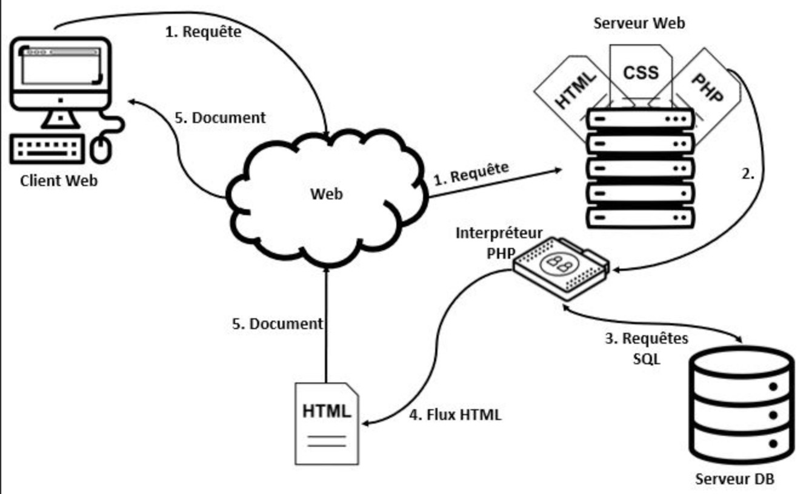

# FailleSecurity Project 

## Généralité 

Le projet a pour vocation d'exploiter une faille pour sensibiliser les personnes aux attaques de cybersécurité. 
## British Airways et sa faille XSS
**Service compromis**. 

La faille que nous avons choisit est de type XSS et a touché British Airways en 2018. 
L’entreprise a subi une attaque Magecart sur sa page de paiement en ligne.  
Les attaquants ont réussi à injecter des lignes de code JavaScript dans une bibliothèque tierce (Modernizr) chargée par le site web de British Airways.  
Ce script captait les informations saisies dans le formulaire  que remplissait l’utilisateur (nom, adresse, numéro de carte...) au moment où il validait son paiement.  
Puis les envoyait vers un domaine contrôlé par les attaquants.  
L’attaque a duré environ 2 semaines, affectant plus de 380 000 clients.  
Ces données sensibles ont été exfiltrées sans interrompre la procédure de paiement normale, ce qui rendait l’attaque furtive.  
Ainsi, cette attaque est une compromission de l'intégrité du code puisque les attaquant ont rajouté des lignes de java et une compromissions des données car ce code leur permettait d'exporter des données sensibles d'utilisateurs vers leur propre domaine.

**Vulnérabilité expliquée (à arranger)**  
 
 Les attaques côté client exploitent la relation de confiance entre un utilisateur et les sites Web qu'il visite = attaque où la connexion au contenu malveillant est initiée à partir du client (généralement en étant incité à cliquer sur un lien malveillant dans un e-mail, un message instantané, ou autre : user interaction often needed), contrairement aux server-side attacks où le serveur initie l'attaque (par exemple SQL injection).

l'attaquant envoie un lien ou autre. Le client clique et initie la connection au serveur malicieux. Puis, le serveur renvoie le code malicieux.
L'objectif étant de cibler les vulnérabilités de l'appareil client ou d'un ou plusieurs de ses logiciels (comprennent des logiciels de traitement de texte, lecteur PDF, des navigateurs Web, environnement Java, etc). Dans le but d’obtenir des informations sensibles (cookies, identifiants, numéro de CB, etc.) ou carrément de prendre le contrôle des postes de travail infectés.

Types de client-side attacks : cross-site scripting (xss), cross-site request forgery (csrf), content spoofing, session fixation, clickjacking

**Architecture et schéma de la faille**



**Comment se prémunir ?**

- Protéger notre code java en incorporant dans le code php la détection de balises **"script"**

- Mettre en place une CSP (Content Security Policy): cela permet de limiter les sources autorisées pour charger du JavaScript. Ainsi, même si un script malveillant est injecté, le navigateur le bloque s’il vient d’une source qui n'est pas autorisée.

- Mettre en place un SRI (SubResource Integration) permet de vérifier automatiquement que les fichiers JavaScript chargés (librairies externes) n'ont pas été modifiés. Donc, si un attaquant modifie un script légitime (comme dans l’affaire British Airways), le navigateur bloque immédiatement son chargement.

- Mettre en place une solution de file integrity monitoring qui permet de détecter une modification non autorisée dans les fichiers JavaScript du serveur et la bloque. 

Plus généralement pour réduire les potentiel attaque xss par injection de code, il faut limiter les scripts tiers sur le site. On peut également Utiliser des outils d’analyse automatisée (SAST / DAST) permet de détecter les failles XSS ou les scripts suspects.
Plus précisément un Un SAST (Static Application Security Testing) est une méthode d’analyse de sécurité qui consiste à examiner le code source d’une application sans l’exécuter, afin de détecter automatiquement des failles comme les XSS, injections SQL ou erreurs de sécurité dès la phase de développement. En effet, il permet d’identifier les vulnérabilités avant la mise en production, directement dans le code, ce qui réduit les risques et le coût des corrections.


```
**Quelles sont les bonnes pratiques à effectuer ?**

## Exploitation de la faille de sécurité (Démo)


## Source utilisé pour notre devoir
https://www.youtube.com/watch?v=E47rY21gXSY

https://schoenbaum.medium.com/inside-the-breach-of-british-airways-how-22-lines-of-code-claimed-380-000-victims-8ce1582801a0

https://www.orsys.fr/orsys-lemag/Glossaire/csp-%F0%9F%9F%A2-protection/

https://www.feroot.com/education-center/what-is-subresource-integrity-sri/

https://www.wiz.io/fr-fr/academy/static-application-security-testing-sast
